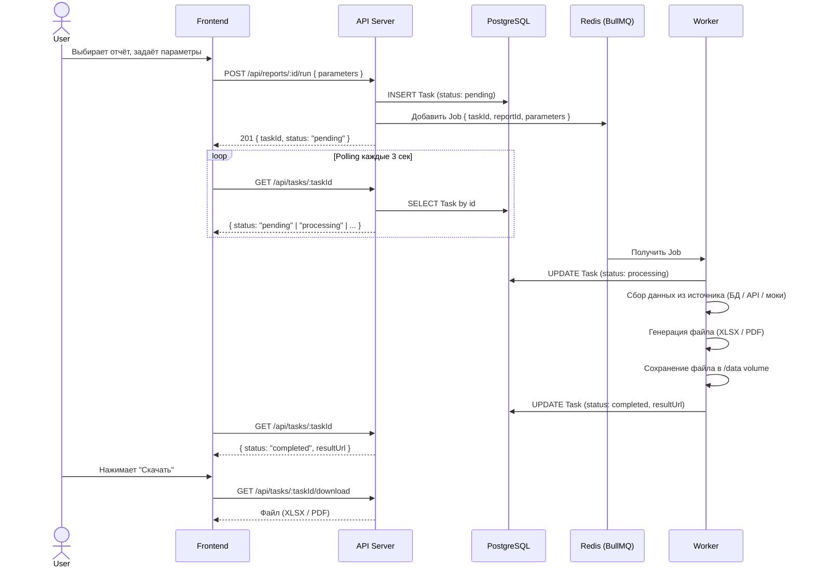

# ARCHITECTURE.md — Report Platform

## Содержание

1. [Архитектура — компоненты, потоки данных, границы ответственности](#1-архитектура)
2. [Источники данных — абстракция над БД, API, файлами, моками](#2-источники-данных)
3. [Как добавить новый отчёт — пошаговая инструкция](#3-как-добавить-новый-отчёт)
4. [Принятые решения и альтернативы](#4-принятые-решения-и-альтернативы)
5. [Что не сделали и почему. Что бы добавили для продакшена](#5-что-не-сделали-и-почему)

---

## 1. Архитектура

### 1.1 Обзор

Платформа состоит из пяти изолированных компонентов (контейнеров), каждый из которых имеет чёткую зону ответственности. Все компоненты поднимаются одной командой `docker-compose up`.

| Компонент | Технология | Зона ответственности |
|-----------|-----------|---------------------|
| **Frontend** | React + Vite + shadcn/ui + Tailwind CSS | UI: каталог отчётов, форма запуска, мониторинг статусов задач, скачивание результатов |
| **API Server** | Node.js + Express + TypeScript | HTTP API: приём запросов, валидация, постановка задач в очередь, отдача статусов и файлов |
| **Worker** | Node.js + TypeScript | Фоновая генерация: извлечение задач из очереди, сбор данных из источников, сборка файлов (XLSX/PDF) |
| **PostgreSQL** | PostgreSQL 15 | Персистентное хранилище: задачи (`ReportTask`), их статусы и метаданные |
| **Redis** | Redis 7 | Брокер сообщений: очередь задач между API и Worker (через BullMQ) |

### 1.2 Потоки данных



### 1.3 Границы ответственности

**API Server** никогда не генерирует отчёты. Его единственная задача — быть тонкой прослойкой между пользователем и системой: принять запрос, создать задачу в БД, положить сообщение в Redis и вернуть ответ. Это гарантирует, что API отвечает быстро (< 100ms) вне зависимости от сложности отчёта.

**Worker** — единственный компонент, который имеет доступ к источникам данных и генерирует файлы. Worker масштабируется горизонтально: можно запустить несколько инстансов, и BullMQ автоматически распределит задачи между ними.

**Frontend** не знает ничего о внутреннем устройстве генерации. Он работает только с двумя абстракциями: «список доступных отчётов» и «задачи на генерацию».

### 1.4 Структура проекта

```
report-platform/
├── docker-compose.yml
├── README.md
├── ARCHITECTURE.md
├── packages/
│   ├── shared/               # Общий код: Prisma-схема, типы, интерфейс отчёта
│   │   ├── prisma/
│   │   │   └── schema.prisma
│   │   └── src/
│   │       └── types.ts      # ReportDefinition, TaskStatus и др.
│   ├── backend/              # API Server
│   │   └── src/
│   │       ├── index.ts      # Точка входа Express
│   │       ├── routes/
│   │       │   ├── reports.ts
│   │       │   └── tasks.ts
│   │       └── services/
│   │           └── queue.ts  # BullMQ producer
│   ├── worker/               # Background Worker
│   │   └── src/
│   │       ├── index.ts      # Точка входа: подключение к очереди
│   │       ├── registry.ts   # Авторегистрация отчётов
│   │       └── reports/      # ← Сюда кладутся новые отчёты
│   │           ├── user-export.ts
│   │           └── sales-summary.ts
│   └── frontend/             # React SPA
│       └── src/
│           ├── App.tsx
│           ├── components/
│           └── lib/
│               └── api.ts    # HTTP-клиент к API
└── data/                     # Shared volume для сгенерированных файлов
```

### 1.5 Модель данных

```sql
-- Таблица задач на генерацию отчётов
CREATE TABLE "Task" (
    id          UUID PRIMARY KEY DEFAULT gen_random_uuid(),
    report_id   VARCHAR(255) NOT NULL,        -- ID отчёта из ReportRegistry
    status      VARCHAR(50) DEFAULT 'pending', -- pending | processing | completed | failed
    parameters  JSONB,                         -- Параметры запуска (даты, фильтры)
    result_url  VARCHAR(500),                  -- Путь к сгенерированному файлу
    error       TEXT,                          -- Текст ошибки при status=failed
    created_at  TIMESTAMPTZ DEFAULT NOW(),
    completed_at TIMESTAMPTZ
);
```

### 1.6 API-эндпоинты

| Метод | Путь | Описание |
|-------|------|----------|
| `GET` | `/api/reports` | Список доступных отчётов с метаданными (id, name, описание, схема параметров, поддерживаемые форматы) |
| `POST` | `/api/reports/:id/run` | Запуск генерации. Body: `{ parameters?, format? }`. Возвращает `taskId` |
| `GET` | `/api/tasks` | Список всех запусков (с пагинацией) |
| `GET` | `/api/tasks/:id` | Статус конкретной задачи |
| `GET` | `/api/tasks/:id/download` | Скачивание готового файла |

---

## 2. Источники данных

### 2.1 Требование и мотивация

> **Требование:** «Данные для отчётов приходят из разных источников: внутренние базы данных, внешние API, файлы. Для прототипа источник можно упростить (локальная БД, публичный API, моковые данные) — но должно быть понятно, что в реальности источники будут разными.»

Прямое обращение к Prisma / fetch / fs внутри файла отчёта создаёт две проблемы:

1. **Связанность** — смена источника (БД → API) требует переписывания отчёта целиком.
2. **Тестируемость** — отчёт нельзя проверить без реальной БД или сети.

Решение — два слоя абстракции между отчётом и источником: **Data Sources** (низкий уровень) и **Repositories** (высокий уровень).

### 2.2 Схема слоёв

```
┌─────────────────────────────────────────────────────────┐
│  Report (user-export.ts / sales-summary.ts)             │
│  Работает ТОЛЬКО с репозиториями через ctx.sources      │
└─────────────────────────────────────────────────────────┘
                          ↓
┌─────────────────────────────────────────────────────────┐
│  Repositories — доменные абстракции                     │
│  UserRepository.findInRange(from, to)                   │
│  SalesRepository.summarize(period)                      │
└─────────────────────────────────────────────────────────┘
                          ↓
┌─────────────────────────────────────────────────────────┐
│  Data Sources — технические адаптеры                    │
│  DatabaseSource  │ ApiSource │ FileSource │ MockSource  │
│  (Prisma)        │  (fetch)  │   (fs)    │ (fixtures)   │
└─────────────────────────────────────────────────────────┘
                          ↓
            PostgreSQL  │ HTTP API │ локальные файлы
```

### 2.3 Контракты

Все типы объявлены в `packages/shared/src/types.ts` — shared между backend, worker и frontend:

```typescript
// --- Низкий уровень: источники ---
export interface DatabaseSource {
  findUsers(dateFrom: Date, dateTo: Date): Promise<UserRecord[]>;
}
export interface ApiSource {
  get<T>(path: string, query?: Record<string, string | number>): Promise<T>;
}
export interface FileSource {
  readJson<T>(relativePath: string): Promise<T>;
  readCsv(relativePath: string): Promise<string[][]>;
}

// --- Высокий уровень: доменные репозитории ---
export interface UserRepository {
  findInRange(dateFrom: Date, dateTo: Date): Promise<UserRecord[]>;
}
export interface SalesRepository {
  summarize(period: SalesPeriod): Promise<SalesAggregate[]>;
}

// --- Контейнер, инжектируемый в каждый отчёт ---
export interface ReportSources {
  users: UserRepository;
  sales: SalesRepository;
}

export interface GenerateContext {
  parameters: Record<string, unknown>;
  format: ReportFormat;
  outputDir: string;
  taskId: string;
  sources?: ReportSources; // ← инжектируется Worker'ом
}
```

### 2.4 Реализации

| Источник | Файл | Что делает |
|---|---|---|
| **DatabaseSource** | `packages/worker/src/sources/database.ts` | Оборачивает `PrismaClient`, читает таблицу `User` через `$queryRaw` |
| **ApiSource** | `packages/worker/src/sources/api.ts` | HTTP GET через `fetch` с таймаутом и базовым URL |
| **FileSource** | `packages/worker/src/sources/file.ts` | Читает JSON/CSV из `baseDir` с защитой от `../` escape |
| **MockSource** | `packages/worker/src/sources/mock.ts` | Возвращает фиктивные данные — для unit-тестов и fallback |

Репозитории, использующие источники:

| Репозиторий | Файл | Источник в production | Источник в тестах |
|---|---|---|---|
| `UserRepository` | `packages/worker/src/repositories/user-repository.ts` | `DatabaseSource` → PostgreSQL | `MockDatabaseSource` |
| `SalesRepository` | `packages/worker/src/repositories/sales-repository.ts` | `ApiSource` → jsonplaceholder.typicode.com | `MockApiSource` |

### 2.5 Фабрика источников

`packages/worker/src/sources/index.ts` экспортирует две фабрики:

```typescript
// Production: реальные адаптеры
export function createDefaultSources(options: { prisma: PrismaClient }): ReportSources;

// Тесты: моковые адаптеры с детерминированными данными
export function createMockSources(): ReportSources;
```

Processor при старте вызывает `createDefaultSources({ prisma })` и инжектирует результат в каждый `GenerateContext`. Тесты передают свои моки напрямую через `createProcessor({ sources: ... })`.

### 2.6 Потоки данных в двух текущих отчётах

**`user-export` — внутренняя БД:**

```
ctx.sources.users.findInRange(from, to)
    ↓
UserRepository (packages/worker/src/repositories/user-repository.ts)
    ↓
DatabaseSource.findUsers(from, to)
    ↓
prisma.$queryRaw`SELECT ... FROM "User" WHERE created_at BETWEEN ...`
    ↓
PostgreSQL (seed'ится 40 строк через `make seed`)
```

**`sales-summary` — внешний публичный API:**

```
ctx.sources.sales.summarize(period)
    ↓
SalesRepository (packages/worker/src/repositories/sales-repository.ts)
    ↓
ApiSource.get('posts', { _limit: N })
    ↓
fetch('https://jsonplaceholder.typicode.com/posts?_limit=N')
    ↓
[posts] → агрегация: выручка / продаж / продавцов / средний чек
```

### 2.7 Добавление нового источника / репозитория

Пример: отчёт должен читать CSV-файл с прайсом.

1. Создать репозиторий `packages/worker/src/repositories/pricing-repository.ts` с интерфейсом `PricingRepository` (объявить в `shared/src/types.ts`). Внутри — `fileSource.readCsv('prices.csv')`.
2. Добавить поле `pricing: PricingRepository` в `ReportSources`.
3. В `createDefaultSources` собрать репозиторий из `createFileSource({ baseDir: '/data/sources' })`.
4. В `createMockSources` — из `createMockFileSource({ 'prices.csv': '...' })`.
5. Отчёт использует `ctx.sources.pricing.getPrices()` — ничего не знает о `fs`.

### 2.8 Что это даёт

| Свойство | Как достигается |
|---|---|
| **Смена источника без переписывания отчёта** | Отчёт зависит от `UserRepository`, а не от Prisma. Меняется реализация репозитория — отчёт остаётся тем же |
| **Unit-тесты без БД и сети** | Тесты отчётов вызывают `generate()` без `ctx.sources` → отчёт использует `createMockSources()` как fallback |
| **Разные источники для одного репозитория** | `UserRepository` может иметь две реализации: через БД для prod и через API для read-replica в другой среде |
| **Single source of truth для типов данных** | `UserRecord`, `SalesAggregate` объявлены в shared — отчёт и репозиторий используют одни типы |

### 2.9 Упрощения прототипа

| Что упрощено | Как бы сделали в продакшене |
|---|---|
| `ApiSource` — без retry и circuit-breaker | `undici` + `p-retry` с экспоненциальным backoff, health-checks, Dead Letter Queue для упавших выборок |
| Публичный API без аутентификации | Секреты через Vault / AWS Secrets Manager, rotation, per-tenant scoping |
| `DatabaseSource` делает `$queryRaw` напрямую | Отдельная read-реплика, connection pooling per source, таймауты на уровне запроса |
| `FileSource` — локальный диск | S3 / MinIO с pre-signed URL и lifecycle-политиками |
| Один набор `ReportSources` на все отчёты | Per-report bundle: отчёт декларирует, какие источники ему нужны (`requires: ['users', 'pricing']`) — worker собирает только их |

---

## 3. Как добавить новый отчёт

> **Ключевое бизнес-требование:** от идеи до готового отчёта в продакшене — один рабочий день. Архитектура платформы спроектирована так, чтобы разработчик мог сфокусироваться только на бизнес-логике отчёта, не трогая инфраструктурный код.

### 3.1 Концепция: Report Registry

Все отчёты в системе реализованы как самостоятельные модули в папке `packages/worker/src/reports/`. При старте Worker автоматически сканирует эту папку и регистрирует все найденные отчёты. **Ни API, ни фронтенд не нужно менять** при добавлении нового отчёта.

Каждый отчёт — это TypeScript-файл, который экспортирует объект, реализующий интерфейс `ReportDefinition`:

```typescript
// packages/shared/src/types.ts

export interface ReportDefinition {
  /** Уникальный идентификатор отчёта */
  id: string;

  /** Человекочитаемое название */
  name: string;

  /** Описание: что покажет этот отчёт */
  description: string;

  /** Поддерживаемые форматы вывода */
  formats: ('xlsx' | 'pdf')[];

  /** JSON Schema параметров, которые пользователь может заполнить в UI.
   *  Фронтенд автоматически сгенерирует форму по этой схеме */
  parametersSchema: Record<string, ParameterField> | null;

  /** Функция генерации отчёта. Получает параметры, возвращает путь к файлу */
  generate(context: GenerateContext): Promise<string>;
}

export interface ParameterField {
  type: 'string' | 'number' | 'date';
  label: string;
  required: boolean;
  default?: string | number;
}

export interface GenerateContext {
  parameters: Record<string, unknown>;
  format: 'xlsx' | 'pdf';
  outputDir: string;   // папка для записи результата
  taskId: string;      // ID задачи для уникального именования файла
}
```

### 3.2 Пошаговая инструкция

**Шаг 1.** Создайте файл в `packages/worker/src/reports/`:

```bash
touch packages/worker/src/reports/marketing-stats.ts
```

**Шаг 2.** Реализуйте интерфейс `ReportDefinition`:

```typescript
// packages/worker/src/reports/marketing-stats.ts

import { ReportDefinition, GenerateContext } from '@shared/types';
import ExcelJS from 'exceljs';
import path from 'path';

const report: ReportDefinition = {
  id: 'marketing-stats',
  name: 'Маркетинговая статистика',
  description: 'Отчёт по эффективности рекламных кампаний за выбранный период',
  formats: ['xlsx'],

  parametersSchema: {
    dateFrom: { type: 'date', label: 'Дата начала', required: true },
    dateTo:   { type: 'date', label: 'Дата окончания', required: true },
    channel:  { type: 'string', label: 'Рекламный канал', required: false, default: 'all' },
  },

  async generate(ctx: GenerateContext): Promise<string> {
    // 1. Получаем данные из источника
    //    (БД, внешний API, моковые данные — зависит от отчёта)
    const data = await fetchMarketingData(ctx.parameters);

    // 2. Формируем файл
    const workbook = new ExcelJS.Workbook();
    const sheet = workbook.addWorksheet('Статистика');
    sheet.columns = [
      { header: 'Кампания', key: 'campaign', width: 30 },
      { header: 'Показы', key: 'impressions', width: 15 },
      { header: 'Клики', key: 'clicks', width: 15 },
      { header: 'CTR, %', key: 'ctr', width: 10 },
    ];
    data.forEach(row => sheet.addRow(row));

    // 3. Сохраняем и возвращаем путь
    const filePath = path.join(ctx.outputDir, `${ctx.taskId}.xlsx`);
    await workbook.xlsx.writeFile(filePath);
    return filePath;
  },
};

export default report;
```

**Шаг 3.** Готово. Пересоберите контейнер Worker:

```bash
docker-compose up --build worker
```

Отчёт автоматически появится в UI — фронтенд получит его через `GET /api/reports`, а форма параметров будет сгенерирована на основе `parametersSchema`.

### 3.3 Как это работает под капотом

```typescript
// packages/worker/src/registry.ts (упрощённо)

import fs from 'fs';
import path from 'path';
import { ReportDefinition } from '@shared/types';

const reportsDir = path.join(__dirname, 'reports');
const registry = new Map<string, ReportDefinition>();

// Автоматически импортируем все файлы из папки reports/
for (const file of fs.readdirSync(reportsDir)) {
  if (file.endsWith('.ts') || file.endsWith('.js')) {
    const report = require(path.join(reportsDir, file)).default;
    registry.set(report.id, report);
  }
}

export function getReport(id: string): ReportDefinition | undefined {
  return registry.get(id);
}

export function getAllReports(): ReportDefinition[] {
  return Array.from(registry.values());
}
```

---

## 4. Принятые решения и альтернативы

### Решение 1: Выделение Worker в отдельный процесс

| | Вариант A: Генерация в API | Вариант B: Отдельный Worker ✅ |
|-|---------------------------|-------------------------------|
| **Плюсы** | Меньше компонентов, проще деплой | Не блокирует API, масштабируется независимо |
| **Минусы** | Блокирует Event Loop Node.js → API перестаёт отвечать | Добавляет Redis и ещё один сервис |

**Почему выбрали B:** Node.js — однопоточный. Генерация XLSX на 100 000 строк или PDF с графиками может занимать секунды. Всё это время Event Loop заблокирован — API не отвечает никому. Отдельный Worker-процесс решает эту проблему полностью и позволяет в будущем масштабировать генерацию горизонтально (запустить 5 воркеров — BullMQ раздаст задачи).

---

### Решение 2: Redis + BullMQ как брокер очередей

| | RabbitMQ | Kafka | Redis + BullMQ ✅ |
|-|----------|-------|-------------------|
| **Надёжность** | Высокая (AMQP) | Очень высокая | Достаточная (Redis persistence) |
| **Сложность** | Средняя | Высокая | Низкая |
| **Доп. инфра** | Отдельный сервис | Отдельный кластер | Redis часто уже есть |
| **Фичи** | Routing, DLQ | Стриминг, партиции | Retries, rate limiting, priorities |

**Почему выбрали BullMQ:** Для платформы отчётов не нужна гарантия доставки уровня Kafka и сложная маршрутизация RabbitMQ. BullMQ из коробки даёт автоматические retries, concurrency control, rate limiting и приоритеты задач. При этом Redis — легковесный и часто уже используется для кэширования. Один сервис на две задачи.

---

### Решение 3: PostgreSQL как источник истины для статусов задач

| | Хранить только в Redis (BullMQ state) | PostgreSQL ✅ |
|-|---------------------------------------|--------------|
| **Плюсы** | Нет дублирования, всё в одном месте | Персистентность, SQL-запросы, аналитика |
| **Минусы** | Данные эфемерны, нет SQL | Дополнительная запись в БД |

**Почему выбрали PostgreSQL:** BullMQ хранит состояние задач в Redis, но Redis — in-memory хранилище. При перезапуске или переполнении памяти данные могут быть потеряны. PostgreSQL даёт:
- Надёжное хранение истории всех запусков
- Возможность строить аналитику (какие отчёты чаще запускают, процент ошибок)
- Простой SQL для интерфейса списка задач с фильтрацией и пагинацией

---

### Решение 4: Polling вместо WebSockets / SSE

| | WebSockets | Server-Sent Events | Polling ✅ |
|-|------------|--------------------|----|
| **Реал-тайм** | Мгновенно | Мгновенно | Задержка 3 сек |
| **Сложность** | Высокая (state, reconnect) | Средняя | Минимальная |
| **Инфра** | Sticky sessions, CORS | Проксирование | Стандартный HTTP |

**Почему выбрали Polling:** Генерация отчёта занимает секунды-минуты. Пользователь запускает отчёт раз в день, а не раз в секунду. Задержка в 3 секунды между обновлениями статуса абсолютно приемлема. WebSockets добавили бы сложность в инфраструктуру (sticky sessions при масштабировании, обработка разрывов соединения) без ощутимой выгоды для пользователя.

---

### Решение 5: Автоматическое обнаружение отчётов (File-based Registry) vs Ручная регистрация

| | Ручная регистрация (массив) | File-based Registry ✅ |
|-|-----------------------------|------------------------|
| **DX** | Нужно править два файла | Один файл — и готово |
| **Ошибки** | Забыли добавить в массив | Невозможно забыть |
| **Гибкость** | Полный контроль | Конвенция важнее конфигурации |

**Почему выбрали File-based Registry:** Бизнес-требование — «от идеи до продакшена за один день», и «отчёты пишут разные разработчики». Чем меньше шагов и файлов нужно менять, тем меньше вероятность ошибки. Worker при старте автоматически сканирует папку `reports/` и регистрирует всё найденное. Разработчик добавляет один файл — и отчёт появляется в системе.

---

## 5. Что не сделали и почему

Следуя принципу «думайте широко, реализуйте узко», мы осознанно оставили ряд аспектов за рамками прототипа. Ниже — что именно, почему, и как бы мы это реализовали в продакшене.

### 5.1 Аутентификация и авторизация

**Что сделали:** Все эндпоинты открыты, аутентификация отсутствует. В ключевых местах кода оставлены комментарии `// TODO: Auth`.

**Почему не сделали:** Авторизация не входила в требования задания. Реализация полноценного auth-слоя (JWT, refresh tokens, RBAC) заняла бы значительную часть бюджета времени без демонстрации архитектурного мышления в контексте отчётов.

**Как бы сделали в продакшене:**
- JWT-аутентификация через middleware на Express
- Ролевая модель: роли привязаны к `reportId` (кто какие отчёты может запускать)
- Интеграция с корпоративным SSO (OAuth2 / SAML)

### 5.2 Хранение файлов

**Что сделали:** Сгенерированные файлы пишутся на Docker Volume, общий между API и Worker.

**Почему:** Для прототипа этого достаточно — файлы доступны обоим сервисам, легко скачиваются.

**Как бы сделали в продакшене:**
- Worker стримит файл напрямую в S3 / MinIO
- В БД сохраняется pre-signed URL с ограниченным временем жизни
- CDN для раздачи файлов
- Lifecycle-политики S3 для автоудаления старых файлов

### 5.3 Реал-тайм обновления статусов

**Что сделали:** Frontend опрашивает API каждые 3 секунды (polling).

**Почему:** Для сценария «запустил отчёт — подождал — скачал» задержка 3 секунды несущественна, но на порядок проще в реализации.

**Как бы сделали в продакшене:**
- Server-Sent Events (SSE) — Worker при обновлении статуса публикует в Redis Pub/Sub → API стримит события клиенту
- SSE предпочтительнее WebSockets: однонаправленный поток (сервер → клиент), нативная поддержка браузеров, работает через стандартные HTTP-прокси

### 5.4 Изоляция кода отчётов

**Что сделали:** Все отчёты выполняются в процессе Worker. Если один отчёт упадёт с OOM или зависнет — пострадает весь Worker.

**Как бы сделали в продакшене:**
- Запуск каждого отчёта в отдельном дочернем процессе (`child_process.fork`) с таймаутом и лимитом памяти
- Или: запуск в ephemeral-контейнерах (Kubernetes Jobs / AWS Lambda)
- Плюс: sandbox через `vm2` или `isolated-vm` для кастомных отчётов от пользователей

### 5.5 Мониторинг и наблюдаемость

**Что не сделали:** Логирование минимальное (`console.log`), нет метрик, нет трейсинга.

**Как бы сделали в продакшене:**
- Structured logging (Pino / Winston) с корреляционным `taskId` во всех логах
- BullMQ Dashboard (Bull Board) для мониторинга очереди
- Prometheus-метрики: время генерации, процент ошибок, размер очереди
- Алерты при росте очереди или повышенном проценте ошибок

### 5.6 Тестирование

**Что сделали:** Реализовали три уровня тестирования — unit, integration и E2E.

**Unit-тесты (Vitest)** — `packages/*/src/**/*.test.ts`:

| Файл | Что проверяет |
|---|---|
| `worker/src/reports/user-export.test.ts` | Генерирует Excel, проверяет заголовки (id / email / createdAt) и строки |
| `worker/src/reports/sales-summary.test.ts` | Генерирует PDF, проверяет сигнатуру `%PDF-` |
| `worker/src/processor.test.ts` | Переходы статусов pending → processing → completed / failed, запись `resultUrl` |
| `worker/src/registry.test.ts` | Авто-обнаружение модулей, детекция дублей и невалидных форматов |
| `shared/src/types.test.ts` | TypeScript-контракты: TaskStatus, ReportDefinition, ParameterField |
| `backend/src/app.test.ts` | `/health` эндпоинт, 404-обработчик, валидация env-переменных |
| `backend/src/routes/reports.test.ts` | `GET /api/reports`, `POST /api/reports/:id/run` (валидация, ошибки) |
| `backend/src/routes/tasks.test.ts` | Пагинация, получение задачи, стриминг XLSX/PDF при скачивании |
| `backend/src/services/queue.test.ts` | Постановка задачи в очередь, идемпотентность, ошибки Redis |
| `frontend/src/pages/ReportsCatalog.test.tsx` | Рендеринг карточек, пустое состояние, навигация |
| `frontend/src/hooks/useTaskPolling.test.tsx` | Цикл поллинга pending → completed |
| `frontend/src/components/ParametersForm.test.tsx` | Рендер полей, валидация required, сабмит |

**E2E-тесты (Playwright)** — `e2e/platform.spec.ts`:

Полный сценарий: каталог → выбор отчёта → заполнение параметров → запуск → поллинг статуса → скачивание XLSX. Global setup поднимает Docker-стек, global teardown сносит его. Запуск: `make e2e`.

**Что не покрыто:**
- `repositories/` и `sources/` (DatabaseSource, ApiSource, MockSource) — нет юнит-тестов на уровне адаптеров
- Backend middleware / error handler pipeline
